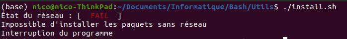
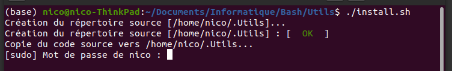
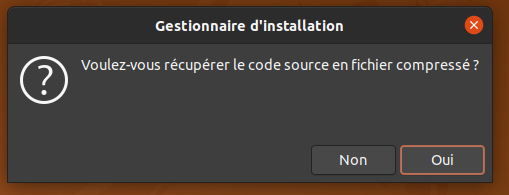

# Installation du logiciel Utils
*********************

## Sommaire

- Présentation
- Prérequis
- Installation
- Erreurs possibles
- Mises à jour évolutives
- Récupération des sources
- Licence

## Présentation

Le logiciel `Utils` est un utilitaire qui va vous permettre d'installer très facilement de nombreux logiciels basés sous Debian.

Il fournit également des outils divers et variés pour administrer le logiciel.

Il vous est donc possible d'améliorer le logiciel.

*********************

## Prérequis

Il est nécéssaire de posséder une installation Linux basée sous Debian. Voici une liste des distributions possibles (non-exaustive) :

- Linux Mint 
- Ubuntu

Il convient également de posséder une connexion Internet.

Le cas échéant, lors du lancement du programme d'installation, l'erreur suivante intervient :




## Installation

Une fois placé dans le dossier Utils, ouvrez un terminal et saississez :

 - ```chmod +x install.sh```

Enfin, executez le programme en faisant :

 - ```sudo ./install.sh```

le programme va commencer par demander votre mot de passe. Une zone de saisie va apparaitre.



Si vous ne voyez pas les caractères que vous tapez, c'est tout à fait normal.

En cas de doute de saisie, pressez plusieurs fois la touche "Retour en arrière" et saississez à nouveau le 
mot de passe puis validez avec le bouton "Entrée".

## Précisions lors de l'installation du logiciel Utils.

Tous les fichiers utilisés et maintenus par `Utils` seront stockés dans votre espace personnel (variable d'environnement $HOME) dans le dossier caché appelé .Utils

Le logiciel enregistre des alias de commande dans le fichier .bash_alias. 

Ce fichier est mis à jour à chaque installation et suppression du logiciel `Utils`

Voici la liste des logiciels installé par `Utils`

- snap

    Un gestionnaire de paquet

- zenity

    Une bibliothèque graphique

- tree

    Un utilitaire de création d'arbres pour les répertoires

- hardinfo

    Un utilitaire d'affichage des paramètres ordinateurs

- zip

    Un gestionnaire d'archives

- python3-pip

    Un utilitaire de gestion de bibliothèques Python

- okular

    Un lecteur de fichier PDF

## Commandes

La documentation pour chaque `commande` est disponible en saisissant la commande `man commande`

### Commandes locales

- server_config

Définit les paramètres du serveur distant

- server_connect

Initialise une connexion avec le serveur SSH distant

- server_restart

Redémarre le serveur SSH distant

- server_shutdown

Eteint le serveur SSH distant

- server_network

Analyse le réseau local du serveur SSH distant

- server_update

Met à jour les logiciels et paquets de la distribution installée sur le serveur SSH distant

- server_update

Met à jour la distribution installée sur le serveur SSH distant

- server_sync_web

Met à jour le contenu du serveur WEB installé sur le serveur SSH distant


## Bilbiothèques utilisée

- Colors

Permet d'afficher du texte et l'arrière-plan en couleur

- Time

Permet de récuperer l'heure

- Systeme

Permet de récupérer des informations sur le système

- createc

Permet de générer des fichier C

- File

Permet de vérifier le contenu d'un dossier

- Network

Permet de scanner le réseau et de récuperer des informations (adresse IP, MAC)


- Videos

Permet d'utiliser une caméra [Architecture ARM rapsberry-pi]


## Configuration de Mysql


Dans un terminal : 

``` 
sudo mysql --user=root
```

Dans Mysql

```
DROP USER 'root'@'localhost';  

CREATE USER 'root'@'localhost' IDENTIFIED BY 'password';  

GRANT ALL PRIVILEGES ON *.* TO 'root'@'localhost';  
```

#### Importer une base de données

```mysql -u root -p DATA < DATA.sql```


## Mise à jour évolutive

Les mises à jour évolutives concernent l'ajout de logiciels à installer dans la base de données.

Pour cela, il suffit de saisir la commande ```utils-add-software``` et une interface se lance. 

Elle vous demande si vous avez plusieurs paquets à installer. Si oui, valider par `Oui`, sinon faire `Non` pour installer plusieurs paquets.

On vous demande ensuite certaines informations à propos du gestionnaire de paquets à utiliser.

Notamment : 

- apt
- apt-get 
- snap


## Récupération de la mise à jour

Pour récuperer l'intégralité du logiciel Utils, il suffit de lancer la commande ```utils-get``` dans un terminal.



A ce moment là, après validation de l'interface graphique, vous obtenez un fichier compressé nommé *Utils.zip* et qui se charge dans votre espace personnel.


## Versions

Numéros de version| Description | Date
:------------ | :------------- | :-----------
1.0 | Première publication avec le minimum pour installer les logicicels | juin 2019
2.0 | Mise à jour de l'installateur | septembre 2019
3.0 | Mise à jour de l'installateur | janvier 2020

## Licence et contributeurs

- Auteur  : Nicolas Le Guerroué
- Date    : 04/04/2019
- Licence : GPL


